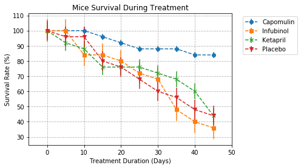

# Observations

* Of the drug treatments, Capomulin shows the most promise. It decreased tumor volume, had markedly better survival rates, and had relatively less aggressive growth of metastatic sites compared to the other treatments.

* Capomulin is also the most consistent of the treatments, as it has the smallest error bar and standard error of all the logged treatments.

* The value of the metastatic sites count data point is worth exploring further. Infubinol has a noteable better job of limiting metastatic sites than Ketapril and the placebo, however it has the worst survival rate of the four treatments.

For the other data points, the treatments either track the placebo or break off showing some promise.

```python
#import dependencies

import pandas as pd
import matplotlib.pyplot as plt
import numpy as np
import seaborn as sns
```


```python
#store raw data, print info() for overview of available data

trial_data = pd.read_csv('raw_data/clinicaltrial_data.csv')
drug_data = pd.read_csv('raw_data/mouse_drug_data.csv')

print(trial_data.info())

print(drug_data.info())

# Merge the two together to put drug data in the clinical trial data

trial_data = trial_data.merge(drug_data, on='Mouse ID', how='left')

print(trial_data.info())

#isolate relevant data
trial_data = trial_data[(trial_data['Drug']=='Capomulin') |
                        (trial_data['Drug']=='Infubinol') |
                        (trial_data['Drug']=='Ketapril') |
                        (trial_data['Drug']=='Placebo')]

#reset the index
trial_data = trial_data.reset_index(drop=True)
```

    <class 'pandas.core.frame.DataFrame'>
    RangeIndex: 1893 entries, 0 to 1892
    Data columns (total 4 columns):
    Mouse ID              1893 non-null object
    Timepoint             1893 non-null int64
    Tumor Volume (mm3)    1893 non-null float64
    Metastatic Sites      1893 non-null int64
    dtypes: float64(1), int64(2), object(1)
    memory usage: 59.2+ KB
    None
    <class 'pandas.core.frame.DataFrame'>
    RangeIndex: 250 entries, 0 to 249
    Data columns (total 2 columns):
    Mouse ID    250 non-null object
    Drug        250 non-null object
    dtypes: object(2)
    memory usage: 4.0+ KB
    None
    <class 'pandas.core.frame.DataFrame'>
    Int64Index: 1906 entries, 0 to 1905
    Data columns (total 5 columns):
    Mouse ID              1906 non-null object
    Timepoint             1906 non-null int64
    Tumor Volume (mm3)    1906 non-null float64
    Metastatic Sites      1906 non-null int64
    Drug                  1906 non-null object
    dtypes: float64(1), int64(2), object(2)
    memory usage: 89.3+ KB
    None


```python
def create_basic_scatter(field):
    
    #Creates a groupby object for mean of tumor sizes by drug and timepoint, then converts to DF
    group = trial_data.groupby(['Drug', 'Timepoint'])[field].mean()
    fieldmean = group.to_frame()

    #Re-arranging the format of the multi-index DF for insertion into a scatter plot
    fieldmean = fieldmean.unstack().transpose().reset_index(level=0, drop=True)

    #Create data for x-axis (time) and labels (drug names)
    timepoint = fieldmean.index
    drugs = fieldmean.columns

    #standard error calculation for error bar
    standard_error=fieldmean.sem()

    #marker array to cycle through in loop for data point differentiation
    markers = ['o', 's', 'x', 'v']

    #loop through each unique drug in drug name, and create scatter plot w/ error bars
    for x in range(len(drugs)):

        volume_line=fieldmean.iloc[:, x]

        marker_position = (x)%4
    
        plt.errorbar(timepoint, volume_line, yerr=standard_error[x], marker=markers[marker_position], linestyle='dashed')

    #grid
    plt.grid(linestyle='dashed')

    #anchors legend to outside of the chart
    plt.legend(bbox_to_anchor=(1.04,1), loc="upper left")

    #limits
    plt.xlim(min(timepoint)-5, max(timepoint)+5)

```

# Scatter plot, tumor volume for each treatment


```python
create_basic_scatter('Tumor Volume (mm3)')

#title
plt.title('Tumor Volume During Treatment')

#axes labels
plt.xlabel('Time (Days)')
plt.ylabel('Tumor Size (mm3)')

#show plot
plt.show()
```


# Scatter plot, number of metastatic sites for each treatment


```python
create_basic_scatter('Metastatic Sites')

#title
plt.title('Metastatic Sites During Treatment')

#axes labels
plt.xlabel('Treatment Duration (Days)')
plt.ylabel('Number of Metastatic Sites')

#show plot
plt.show()
```


# Scatter plot, survival rates for each treatment


```python
# How can I make create_basic_scatter() more flexible so that I can easily input this?

#Creates a groupby object for mean of tumor sizes by drug and timepoint, then converts to DF
survival_group = trial_data.groupby(['Drug', 'Timepoint'])['Mouse ID'].count()
survival = survival_group.to_frame()

#Re-arranging the format of the multi-index DF for insertion into a scatter plot
survival = survival.unstack().transpose().reset_index(level=0, drop=True)

#Create data for x-axis (time) and labels (drug names)
timepoint = survival.index
drugs = survival.columns

#standard error calculation for error bar
standard_error=survival.sem()/25 * 100

#Need to figure out a better way to do the above that's dynamic, only works right now because each trial has 25 mice

#marker array to cycle through in loop for data point differentiation
markers = ['o', 's', 'x', 'v']

#loop through each unique drug in drug name, and create scatter plot w/ error bars
for x in range(len(drugs)):

    surviving_mice=survival.iloc[:, x]
    
    initial_mice=survival.iloc[0, x]

    marker_position = (x)%4
    
    plt.errorbar(timepoint, surviving_mice/initial_mice * 100, yerr=standard_error[x], marker=markers[marker_position], linestyle='dashed')
    
#title
plt.title('Mice Survival During Treatment')

#grids
plt.grid(linestyle='dashed')

#limits
plt.xlim(min(timepoint)-5, max(timepoint)+5)

#axes labels
plt.xlabel('Treatment Duration (Days)')
plt.ylabel('Survival Rate (%)')

#anchors legend to outside of the chart
plt.legend(bbox_to_anchor=(1.04,1), loc="upper left")

#show plot
plt.show()
```





# Bar chart, tumor volume percent change for each treatment


```python
#This utilizes the same volume groupby object and DF as the first scatter chart.
#Look into how to minimize this code redundancy.
#Creates a groupby object for mean of tumor sizes by drug and timepoint, then converts to DF
tumor_volume_group = trial_data.groupby(['Drug', 'Timepoint'])['Tumor Volume (mm3)'].mean()
tumor_volume = tumor_volume_group.to_frame()

#Re-arranging the format of the multi-index DF for insertion into a scatter plot
tumor_volume = tumor_volume.unstack().transpose().reset_index(level=0, drop=True)

#Blank list to track % change for each treatment
tumor_changes = []

#Blank list to track whether % change is up or down, and colors to assign
bar_colors =[]

for x in range(len(drugs)):

    initial_tumor_size=tumor_volume.iloc[0,x]
    final_tumor_size=tumor_volume.iloc[-1,x]
    tumor_change = (final_tumor_size - initial_tumor_size) / initial_tumor_size*100
    tumor_changes.append(tumor_change)
    
    # adds to bar_colors list and provides a color based on positive/negative value
    if (tumor_change > 0):     
        bar_colors.append('red')
    else:
        bar_colors.append('green')

plt.title('Tumor Volume Changes')        

plt.hlines(0,-1,len(tumor_changes))

plt.xticks(rotation='vertical')

plt.xlabel('Drug')

plt.ylabel('Percent Change in Tumor Volume')

plt.bar(drugs, tumor_changes, color=bar_colors, edgecolor='black')
```


    <Container object of 4 artists>


```python
#Creates a groupby object for mean of tumor sizes by drug and timepoint, then converts to DF
tumor_volume_group = trial_data.groupby(['Drug', 'Timepoint'])['Tumor Volume (mm3)'].mean()
tumor_volume = tumor_volume_group.to_frame()

#Re-arranging the format of the multi-index DF for insertion into a scatter plot
tumor_volume = tumor_volume.unstack().transpose().reset_index(level=0, drop=True)
```
